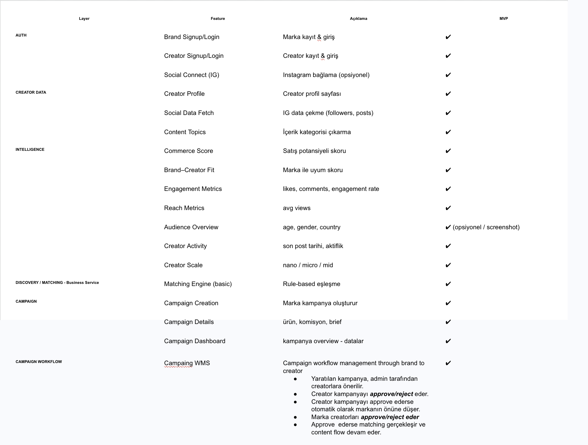
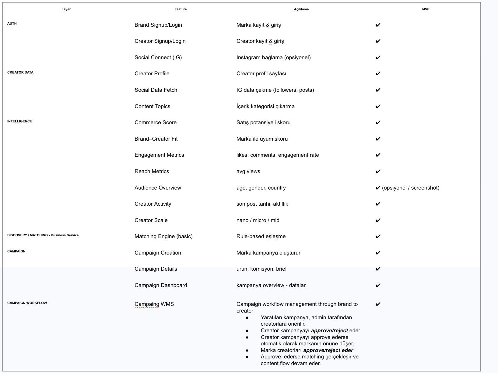

# BOOSPARK — FINAL AGENT ARCHITECTURE

---

## 1. Plan Node Default
- Enter plan mode for ANY non-trivial task (3+ steps or architectural decisions)  
- If something goes sideways, STOP and re-plan immediately - don't keep pushing  
- Use plan mode for verification steps, not just building  
- Write detailed specs upfront to reduce ambiguity  

---

## 2. Subagent Strategy
- Use subagents liberally to keep main context window clean  
- Offload research, exploration, and parallel analysis to subagents  
- For complex problems, throw more compute at it via subagents  
- One task per subagent for focused execution  

---

## 3. Self-Improvement Loop
- After ANY correction from the user: update `tasks/lessons.md` with the pattern  
- Write rules for yourself that prevent the same mistake  
- Ruthlessly iterate on these lessons until mistake rate drops  
- Review lessons at session start for relevant project  

---

## 4. Verification Before Done
- Never mark a task complete without proving it works  
- Diff behavior between main and your changes when relevant  
- Ask yourself: "Would a staff engineer approve this?"  
- Run tests, check logs, demonstrate correctness  

---

## 5. Demand Elegance (Balanced)
- For non-trivial changes: pause and ask "is there a more elegant way?"  
- If a fix feels hacky: "Knowing everything I know now, implement the elegant solution"  
- Skip this for simple, obvious fixes - don't over-engineer  
- Challenge your own work before presenting it  

---

## 6. Autonomous Bug Fixing
- When given a bug report: just fix it. Don't ask for hand-holding  
- Point at logs, errors, failing tests - then resolve them  
- Zero context switching required from the user  
- Go fix failing CI tests without being told how  

---

## Task Management
1. **Plan First**: Write plan to `tasks/todo.md` with checkable items  
2. **Verify Plan**: Check in before starting implementation  
3. **Track Progress**: Mark items complete as you go  
4. **Explain Changes**: High-level summary at each step  
5. **Document Results**: Add review section to `tasks/todo.md`  
6. **Capture Lessons**: Update `tasks/lessons.md` after corrections  

---

## Core Principles
- **Simplicity First**: Make every change as simple as possible. Impact minimal code  
- **No Laziness**: Find root causes. No temporary fixes. Senior developer standards

---

# 2. AI CONFIGURATION — CREATOR INTELLIGENCE LAYER

This section defines the AI and scoring brain of the product. It is intentionally separate from project execution and software architecture.

The intelligence layer should follow the final competitive-complete structure below. This is the source of truth for what the AI system should understand, compute, and evolve toward across phases. The roadmap direction is: first a working system, then more intelligence depth, then a stronger AI moat. fileciteturn6file3

## Creator Intelligence — FINAL FULL SET (Competitive Complete)

| Layer | Metric | Raw Data | Derived | Formül / Logic | Amaç | MVP |
|---|---|---|---|---|---|---|
| **CORE 🔥** | **Commerce Score** | engagement + intent + (future sales) | commerce_score | composite scoring (aşağıda) | karar metriği | ✔ |
| **ENGAGEMENT** | follower_count | API | — | — | büyüklük | ✔ |
|  | avg_likes | post data | avg_likes_30d | son N post ortalaması | performans | ✔ |
|  | avg_comments | post data | avg_comments_30d | son N post ortalaması | performans | ✔ |
|  | avg_views | post data | avg_views_30d | son N post ortalaması | performans | ✔ |
|  | engagement_rate | likes + comments | engagement_rate | (avg_likes + avg_comments) / followers | kalite | ✔ |
| **CONTENT** | content_topics | caption + hashtags | topic list | NLP / regex | kategori | ✔ |
|  | content_format | media type | format_dist | video vs image | içerik tipi | ✖ |
| **CONTEXT** | recent_posts | media list | — | — | manuel kontrol | ✔ |
| **AUDIENCE (TABLE STAKES)** | audience_country | insights API | country_dist | % dağılım | hedefleme | ✖ |
|  | audience_age | insights API | age_dist | % dağılım | hedefleme | ✖ |
|  | audience_gender | insights API | gender_dist | % dağılım | hedefleme | ✖ |
|  | audience_interests | inferred | interest_clusters | ML clustering | targeting | ✖ |
| **BRAND HISTORY 🆕** | past_brand_collabs | platform / scraping | brand_list | list extraction | güven | ✖ |
|  | category_experience | brand data | category_score | count per category | deneyim | ✖ |
| **GROWTH** | follower_growth | snapshots | growth_30d | Δfollowers | momentum | ✖ |
|  | posting_frequency | timestamps | freq_score | posts/time | aktiflik | ✖ |
| **CONSISTENCY 🆕** | performance_stability | post stats | variance_score | std deviation | güvenilirlik | ✖ |
|  | posting_consistency | timestamps | consistency_score | freq stability | sürdürülebilirlik | ✖ |
| **EARLY COMMERCE** | clicks | link tracking | campaign_clicks | count(clicks) | intent proxy | ✖ |
| **REAL COMMERCE 🔥** | revenue_generated | ecommerce | revenue | sum(revenue) | gerçek değer | ✖ |
|  | conversion_rate | clicks + orders | conversion_rate | orders / clicks | satış kalitesi | ✖ |
|  | revenue_per_post | revenue + posts | rev_per_post | revenue / post | efficiency | ✖ |
| **FIT** | product_fit | topics + brand | fit_score | similarity | eşleşme | ✖ |
| **FRAUD (TABLE STAKES)** | fake_followers | anomaly detection | fraud_score | heuristic | güven | ✖ |
|  | suspicious_engagement | pattern data | anomaly_score | ML/heuristic | güven | ✖ |
| **AI / ADVANCED** | predicted_revenue | historical data | predicted_score | ML model | tahmin | ✖ |
|  | predicted_conversion | historical | pred_conv | ML | tahmin | ✖ |
|  | content_quality | media | quality_score | CV/NLP | kalite | ✖ |
|  | sentiment_score | comments/caption | sentiment | NLP | perception | ✖ |

Source alignment for this final intelligence structure and positioning is in the project resource set. fileciteturn6file10

## Commerce Score — MVP / Full / Advanced

### MVP

```text
engagement_rate = (avg_likes + avg_comments) / followers

engagement_score =
0.5 * engagement_rate
+
0.5 * normalize(avg_views)

intent_score =
intent_comments / total_comments   (connected only)

IG_score = 0.6 * engagement_score + 0.4 * intent_score
TT_score = 0.6 * engagement_score + 0.4 * intent_score

Commerce Score =
0.5 * IG_score + 0.5 * TT_score
```

### FULL (Phase 3+)

```text
Commerce Score =
0.3 * engagement
+
0.1 * intent
+
0.3 * revenue_score
+
0.2 * conversion_rate
+
0.1 * product_fit
```

### ADVANCED (Phase 4)

```text
Commerce Score =
real performance
+
predicted performance
+
content intelligence
```

The final intelligence definition and formula direction come from the project resources. fileciteturn6file5

## Critical Product Rule

```text
IF creator connected:
    use intent_score
ELSE:
    intent_score = 0
```

This is a hard product behavior, not an optional engineering preference. It keeps the system robust while creating a connect incentive. fileciteturn6file11

## Data Access Model

```text
DATA ACCESS MODEL

1. Open (bağlantısız):
- follower_count
- likes
- comments_count
- views
- captions

→ creator bağlanmadan çalışır

2. Connected (OAuth required):
- comment text
- advanced insights

→ creator connect ederse gelir

3. Minimum permissions:

Instagram:
- instagram_basic
- pages_read_engagement
- (optional) instagram_manage_comments

TikTok:
- basic profile
- video list
- (optional) comment scope
```

This access model is already defined in the planning resource and should be enforced consistently in product and engineering. fileciteturn6file8

---

# 3. PROJECT CONFIGURATION — SOFTWARE ARCHITECTURE & EXECUTION

This section defines how the product should be built in software.

The roadmap resource points to the project/product deck as the source for product flow and roadmap context. fileciteturn6file7

## Core Product Modules for MVP

1. **Data Ingestion Layer**
   - Instagram open data ingestion
   - TikTok open data ingestion
   - Connected comment ingestion
   - Screenshot ingestion fallback

2. **Commerce Score Engine**
   - avg_likes / avg_comments / avg_views
   - engagement_rate
   - content_topics
   - intent_score (connected only)
   - commerce_score

3. **Campaign Workflow Engine**
   - campaigns are workflow-managed, not simple CRUD
   - state transitions must be explicit and validated

4. **Matching Engine**
   - creator ranking by commerce score
   - brand-facing creator shortlist generation

5. **Agent Learning System**
   - shared memory across agents
   - errors, lessons, decisions persisted and reused

## Campaign Workflow State Machine

```text
DRAFT
→ ACTIVE
→ INVITED
→ ACCEPTED
→ CONTENT_SUBMITTED
→ APPROVED / REVISION
→ PUBLISHED
→ COMPLETED
```

This should be implemented as a workflow engine, not as disconnected admin screens. That principle already exists in prior planning artifacts and remains a hard architectural rule. fileciteturn6file1

---

# 4. AGENT ARCHITECTURE

Only engineering, product, and project-management agents are kept.

## Product / Project Management Agents

### Sprint Prioritizer
**Responsibility**
- MVP scope control
- sprint planning
- feature prioritization
- preventing roadmap drift

**Must enforce**
- no Phase 2+ features inside MVP unless explicitly approved
- no unnecessary complexity
- no intelligence-layer overbuild before product proof

### Project Shipper
**Responsibility**
- execution coordination
- blocker resolution
- delivery tracking across subagents
- keeping build work aligned with `tasks/todo.md`

---

## Engineering Agents

### Backend Architect
**Responsibility**
- DB schema
- ingestion services
- scoring services
- campaign/workflow services
- API surface

**Owns**
- `creator`
- `brand`
- `campaign`
- `content`
- `metrics`
- `score`
- workflow transition logic

### AI Engineer
**Responsibility**
- intelligence layer implementation
- scoring formulas
- NLP for `content_topics`
- intent detection from comment text
- future AI roadmap alignment

**Owns**
- engagement_score
- intent_score
- commerce_score
- content parsing and enrichment

### Frontend Developer
**Responsibility**
- brand dashboard
- creator card
- campaign UI
- workflow visibility

**Creator card MVP should show**
- follower_count
- avg_likes
- avg_comments
- avg_views
- engagement_rate
- commerce_score
- recent_posts
- content_topics

### DevOps Automator
**Responsibility**
- CI/CD
- environments
- deployment
- logging
- error tracking

### API Tester
**Responsibility**
- ingestion validation
- endpoint contract checks
- integration test coverage
- API reliability before release

### Workflow Optimizer
**Responsibility**
- campaign workflow design and enforcement
- state transition validation
- dead-end and invalid-state prevention

### Test Results Analyzer
**Responsibility**
- bug pattern analysis
- failure clustering
- post-test feedback into lessons/memory

---

# 5. AGENT MEMORY & SELF-IMPROVEMENT SYSTEM

## Required Project Folders

```text
/tasks/
  todo.md
  lessons.md

/agent-memory/
  errors/
  learnings/
  decisions/
```

## Rules

### Before starting any non-trivial task
- read relevant entries from `tasks/lessons.md`
- read recent memory from `/agent-memory/errors/` and `/agent-memory/learnings/`
- write a plan into `tasks/todo.md`

### If an error happens
- log it to `/agent-memory/errors/`
- identify root cause
- update `tasks/lessons.md` if the mistake pattern is reusable

### If a repeated success pattern appears
- write it into `/agent-memory/learnings/`

### If an architecture/product decision is made
- write it into `/agent-memory/decisions/`

This is mandatory because the system is expected to learn from failures and propagate those lessons across subagents.

---

# 6. MVP BUILD ORDER

## Sprint 1
- repository structure
- task/memory structure
- ingestion service skeleton
- DB schema for creators, content, metrics
- initial creator ingestion for open data

## Sprint 2
- metric aggregation
- engagement score
- content topic extraction
- commerce score service
- creator card MVP

## Sprint 3
- campaign entity
- campaign workflow state machine
- invite / accept / submit / approve flow
- ranking + matching view

## Sprint 4
- connected account support
- comment ingestion
- intent score
- connect incentive behavior

## Sprint 5
- screenshot ingestion fallback
- memory hardening
- test coverage, observability, production cleanup

---

# 7. HARD RULES

1. **Phase 1 = scoring + workflow**
2. **Connected data is a quality upgrade, not a dependency**
3. **Workflow > CRUD**
4. **Plan-first is mandatory**
5. **No temporary fixes**
6. **Every meaningful correction updates lessons**
7. **The AI system and project system must stay separate but aligned**

---

# 8. FINAL EXECUTION SUMMARY

This project has two different but connected systems:

## A. AI Configuration
This defines **what the product believes**:
- what creator intelligence exists
- what commerce score means
- what data matters now vs later
- how the moat evolves across phases

## B. Project Configuration
This defines **how the product gets built**:
- which agents own what
- what the software modules are
- how workflow management is implemented
- how bugs, lessons, and decisions propagate across the agent system

The final strategic direction is clear:

```text
Others measure influence.
We measure revenue.
```

